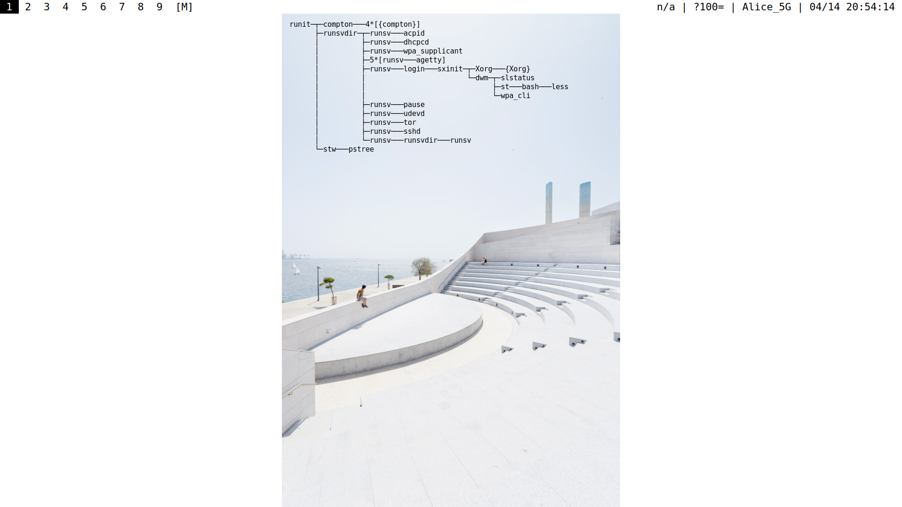

# stw

stw is a simple text window for X.

Here stw runs pstree and renders its output above desktop wallpaper.



```
$ stw -F 'monospace:size=8' pstree -U
```

stw mostly resembles watch command:
it creates an unmanaged X window at specified position and starts subcommand.
If subcommand terminates, stw sleeps specified number of seconds and restarts it.
If stw X window is clicked, stw terminates subcommand and restarts it immediately.
stw buffers subcommand output.
When output line matches specified delimeter line or subcommand terminates, stw renders collected output.
Each time stw renders, it clears both collected output and X window.

It is possible to specify font, text align, text color, background color, opacity, window position, border width, sleep period via command line arguments or config.h file.